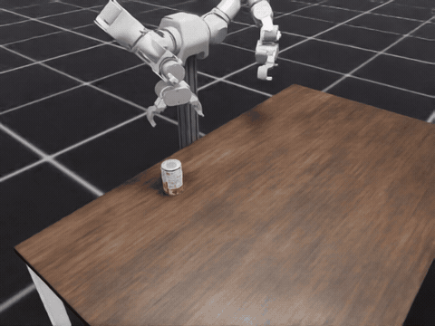
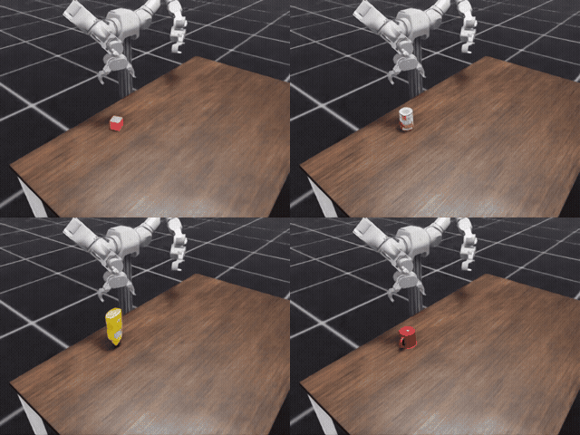
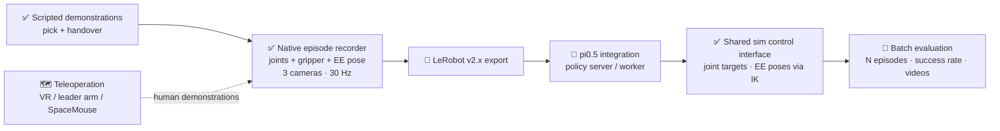
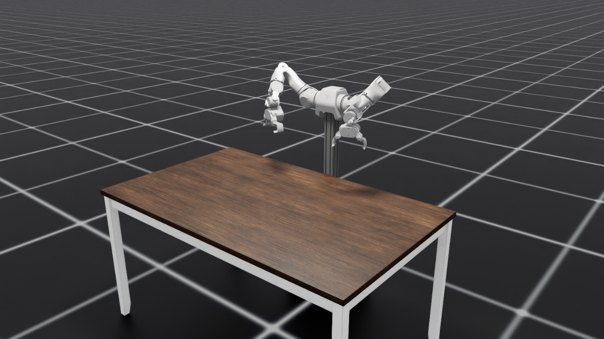
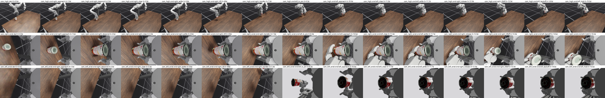

# Issac-sim-teleop-eval

**Bimanual OpenArm manipulation in Isaac Sim: reproducible position-based picks, right-to-left handover, and multimodal demonstration recording—built toward teleoperation, policy training, and automated evaluation.**

[](https://developer.nvidia.com/isaac/sim)
[](https://isaac-sim.github.io/IsaacLab/)
[](https://www.python.org/)

[](#license)



> This project is actively developed. Scripted manipulation and native episode recording are working and verified; LeRobot export, pi0.5 integration, and batch evaluation are in progress. Teleoperation is planned.

## Highlights

- Bimanual **OpenArm v2.0** performs top picks and a coordinated right-to-left soup-can handover at a wooden table.
- A deterministic offline planner combines multi-seed bounded IK, dense 1 cm Cartesian descent/lift waypoints, approach collision checks, and joint-target tracking.
- Demonstrations capture observations **before** each action and record measured and commanded state for both arms at 30 Hz.
- Video-enabled episodes contain joint positions, gripper state, end-effector pose, three synchronized camera videos, and a JSON summary.
- The robot asset was rebuilt from URDF with convex-decomposition colliders and a rigid finger mimic; the gripper is force-limited to 3 N·m.
- Placement was selected through a reachability search: the shoulders sit 0.40 m above the tabletop and 0.05 m behind its edge.
- The engineering trail is documented end to end in [the process log](docs/PROCESS_LOG.md), [design decisions](docs/DECISIONS.md), and [mistakes and lessons](docs/MISTAKES.md).

[Watch the three-camera handover video](media/handover_3cams.mp4) · overhead + right wrist + left wrist



## Pipeline and status

Status markers in this README are literal: **✅ done and verified**, **🚧 in progress**, **🗺️ planned**.



The policy path is designed to drive the simulator through the same joint/end-effector interface already used by the recorder. The diagram describes the intended full architecture; it does not imply that the 🚧 or 🗺️ stages are complete.

## Verified results

Results below are from the final scripted demonstrator, with 10 episodes per task unless noted.

| Task | Verified result |
|---|---:|
| Pick cube (5 cm) | **10/10** |
| Pick soup can (YCB) | **10/10** |
| Pick mustard bottle (YCB) | **10/10** |
| Pick mug (YCB) | **8/10** — two orientations returned `no plan` and were never attempted; all **8/8 executed grasps succeeded** |
| Handover, right → left (soup can) | **10/10**, plus **3/3** recorded on video |

Kinematics and hold checks:

- Forward kinematics matches the simulator to **0.000 mm** across 40 random configurations.
- The robot holds its ready pose to **0.0000 rad**.
- The grippers hold their targets to **0.0 mm**.

## How it works

### Scene and robot



The environment runs on Isaac Sim 5.1 and Isaac Lab 0.47. It combines a grid ground plane, central sphere light, and NVIDIA's ArchVis `EastRural` table: 0.914 × 1.528 m with its top at 0.762 m. Because the visual table asset is not physics-ready, a flush invisible slab supplies tabletop collision.

The fixed-base bimanual OpenArm stands on a pedestal behind the near edge. Its placement and ready pose come from offline reachability and joint-margin searches rather than visual tuning. The arm is modeled as ideally gravity-compensated, while each gripper closes against a 3 N·m effort limit.

### Gripper model grounded in measurements

The simulated hardware did not follow the conventions its original constants suggested, so the gripper was measured directly:

- finger `q = 0` is **closed**;
- maximum opening is **13.9 cm**, approximately **18.5 cm/rad**;
- fingertips sit **0.15–0.17 m** below the gripper frame;
- the usable claw pocket is only about **4 cm** deep, so grasps target the top of each object.

The project owns its URDF-to-USD conversion so the claw geometry uses convex decomposition, the URDF finger mimic is retained, and the mimic constraint is made rigid under contact.

### Position-based pick planner

[`scenes/kinematics.py`](scenes/kinematics.py) implements URDF forward kinematics and bounded numerical IK using NumPy and SciPy, with no Isaac imports. [`scenes/pick_planner.py`](scenes/pick_planner.py) then plans the complete pick before motion begins:

1. Try the current configuration, a known low-reach seed, and random restarts.
2. Reject joint-space approaches that sweep the fingertips through the object.
3. Solve a straight vertical descent and lift with chained IK every 1 cm.
4. Select the feasible plan with the least joint travel.
5. Track the resulting joint targets, closing the force-limited gripper at the measured grasp height.

An unreachable pose is reported as `no plan` and is not executed.

### Upright right-to-left handover



[`scenes/handover_planner.py`](scenes/handover_planner.py) keeps the soup can upright. The right hand picks near the top and carries it to the handover point; the left hand approaches horizontally, wraps the lower body, and closes. The right releases and lifts away before the left backs off while holding the can. Separating the two grips vertically keeps both hands clear and places the can's center of mass inside the receiving grasp.

### Recording format

[`scenes/run_pick.py`](scenes/run_pick.py) and [`scenes/run_handover.py`](scenes/run_handover.py) write runs beneath `artifacts/episodes/<run>/`. Only successful episodes are kept by default; use `--keep-failed` to retain failures.

| Output | Contents | Rate / shape |
|---|---|---|
| `episode_XXXX.npz` | `obs_*` measured before the step's action; `act_*` commanded | 30 Hz |
| `*_joint_pos` | Seven arm-joint positions for each arm | `(T, 7)` |
| `*_gripper` | First finger-joint position for each gripper | `(T,)` |
| `*_ee_pose` | `xyz + quat(wxyz)` in the robot-root frame for each arm | `(T, 7)` |
| `phase` | Planner phase index | `(T,)` |
| `episode_XXXX_<camera>.mp4` | `cam_high`, `cam_right_wrist`, `cam_left_wrist` | 640×480, 30 fps |
| `summary.json` | Episode outcome, object pose, plan/failure details, and run metadata | One per run |

The action end-effector pose is exact FK of the commanded joint target. This joint/gripper/EE schema is the interface intended for the LeRobot and policy integrations now in progress.

## Repository map

```text
.
├── assets/
│   ├── objects/                 # physics-wrapped YCB mug
│   └── openarm/                 # project-owned OpenArm URDF and USD
├── scenes/
│   ├── env_common.py            # table, robot, pedestal, actuators, checks
│   ├── layout.py                # shared placement and ready-pose constants
│   ├── kinematics.py            # standalone FK, bounded IK, gripper model
│   ├── pick_task.py             # object catalog, cameras, observations, success
│   ├── pick_planner.py          # offline position-based pick planner
│   ├── handover_planner.py      # coordinated right-to-left handover
│   ├── run_pick.py              # pick episodes and recording
│   ├── run_handover.py          # handover episodes and recording
│   └── robot_env_scene.py       # base-scene validation entry point
├── tools/                       # conversion, workspace/pose searches, contact sheets
├── tests/                       # kinematics and gripper-contact checks
├── media/                       # showcase GIFs, videos, and phase sheets
├── docs/                        # process log, decisions, and mistakes
└── third_party/openarm_description/
```

## Quickstart

### Requirements

- Linux
- NVIDIA RTX GPU
- Isaac Sim 5.1
- Isaac Lab 0.47.x
- Python 3.11 from the Isaac Sim installation
- Network access for the NVIDIA-hosted ArchVis table and YCB assets

Set `PY` to the Isaac Sim Python executable, then run from the repository root:

```bash
PY=/path/to/isaacsim/bin/python   # Isaac Sim 5.1

# Scripted picks: cube | soup_can | mustard | mug
$PY scenes/run_pick.py --object cube --episodes 5
$PY scenes/run_pick.py --object mug --episodes 10 --no-video --trace

# Right-to-left soup-can handover
$PY scenes/run_handover.py --episodes 3

# Generate a per-phase contact sheet for episode 0
$PY tools/episode_contact_sheet.py artifacts/episodes/<run> 0
```

Validate the base scene, kinematics, and gripper contacts:

```bash
$PY scenes/robot_env_scene.py --headless --steps 120 && \
$PY tests/check_kinematics.py && \
$PY tests/check_gripper_contact.py
```

The converted robot asset is already committed. To regenerate it from the vendored description:

```bash
$PY tools/convert_openarm_urdf.py
```

## Roadmap

- [x] Isaac Sim scene, bimanual OpenArm asset, measured gripper model, and startup checks
- [x] Scripted cube and household-object picks
- [x] Scripted right-to-left soup-can handover
- [x] Joint, gripper, end-effector, and three-camera episode recording
- [ ] **🚧 In progress:** LeRobot v2.x dataset export for recorded episodes
- [ ] **🚧 In progress:** pi0.5 policy server/worker integration through the existing joint/EE interface
- [ ] **🚧 In progress:** batch evaluation harness with N-episode runs, success rate, and rollout videos
- [ ] **🗺️ Planned:** teleoperation with VR, a leader arm, or SpaceMouse for human demonstrations
- [ ] **🗺️ Planned:** more objects and tasks
- [ ] **🗺️ Planned:** domain randomization
- [ ] **🗺️ Planned:** ROS 2 bridge

Current known limits: two tested mug orientations have no reachable grasp yaw and are safely rejected; the table legs are visual only and do not yet have collision.

## Lessons learned

The full catalog contains 34 documented mistakes. A few that materially changed the system:

- **Render and measure the gripper before trusting constants.** The inherited open/close convention was inverted, and the real fingertip offset was 0.15–0.17 m rather than the assumed value.
- **Convex hulls can destroy grasp geometry.** Hull colliders filled the claw pocket; convex decomposition restored physical fingertip contact.
- **Preserve and harden mechanical coupling.** Dropping the URDF mimic made the claws independent, while a soft mimic yielded under load. Keeping it and making it rigid produced symmetric contact.
- **Treat rendered impressions as hypotheses.** A wrist view made the can appear to tip; per-step pose traces showed that it did not. State traces prevented a false diagnosis.
- **Constrain IK only as much as the task requires.** Unnecessary yaw/roll constraints made reachable ready and handover poses appear impossible; workspace sweeps exposed the useful solution families.

See [`docs/MISTAKES.md`](docs/MISTAKES.md) for symptoms, root causes, fixes, and reusable lessons.

## Acknowledgements

- [OpenArm](https://github.com/enactic/openarm) by Enactic. The robot description vendored under `third_party/openarm_description/` is Apache-2.0 licensed; see its included `LICENSE.txt` and `NOTICE.md`.
- NVIDIA Isaac Sim and Isaac Lab for simulation, articulation, sensing, rendering, and asset infrastructure.
- The YCB object models used for the soup can, mustard bottle, and mug.

## License

No project-level license is currently specified in this repository. The vendored OpenArm description retains its own Apache-2.0 license and notices under `third_party/openarm_description/`; NVIDIA-hosted and YCB assets remain subject to their respective terms.
